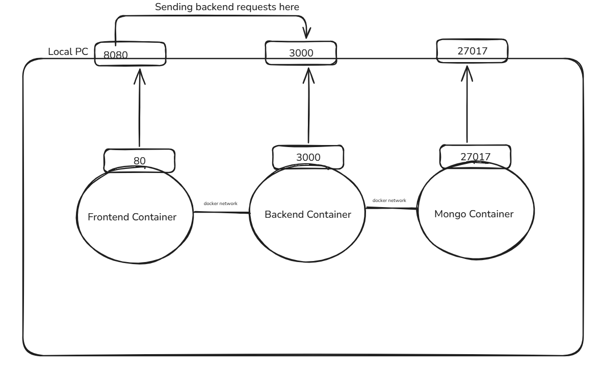
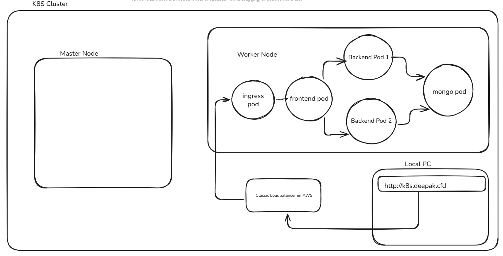

# k8s-fullstack

A **full-stack application** deployed using **Docker Compose** and **Kubernetes**, demonstrating how to containerize frontend and backend services and orchestrate them with Kubernetes.

---

## 📂 Project Structure

```
├─ backend/                 # Backend service (API, database integration, etc.)
├─ frontend/                # Frontend service (UI layer)
├─ ops/                     # Kubernetes manifests, deployment configs
├─ docker-compose.yml       # Local development with Docker Compose
├─ docker-compose-architecture.png   # Docker Compose architecture diagram
├─ k8s-architecture.png     # Kubernetes architecture diagram
└─ .gitignore
```

---

## 🚀 Features

* **Frontend**: A user-facing web interface.
* **Backend**: REST API / service layer for business logic.
* **Ops**: Kubernetes manifests for deployments, services, and configs.
* **Docker Compose**: Simplified local development and testing.
* **Kubernetes Deployment**: Production-ready orchestration and scaling.

---

## 🛠️ Getting Started

### Prerequisites

Make sure you have installed:

* [Docker](https://docs.docker.com/get-docker/)
* [Docker Compose](https://docs.docker.com/compose/)
* [Kubernetes](https://kubernetes.io/docs/tasks/tools/) (minikube or cloud provider)
* [kubectl](https://kubernetes.io/docs/tasks/tools/install-kubectl/)

### Run Locally with Docker Compose

```bash
git clone https://github.com/doomerdpk-1802/k8s-fullstack.git
cd k8s-fullstack
docker-compose up --build
```

This will start both frontend and backend containers. You can then access the app at:

* Frontend: `http://localhost:3000` (or configured port)
* Backend: `http://localhost:8080`

### Deploy on Kubernetes

```bash
kubectl apply -f ops/
```

This applies all manifests (Deployments, Services, ConfigMaps, etc.) to your cluster.

Check running pods and services using kubectl.

---

## 📊 Architecture

### Docker Compose



### Kubernetes




